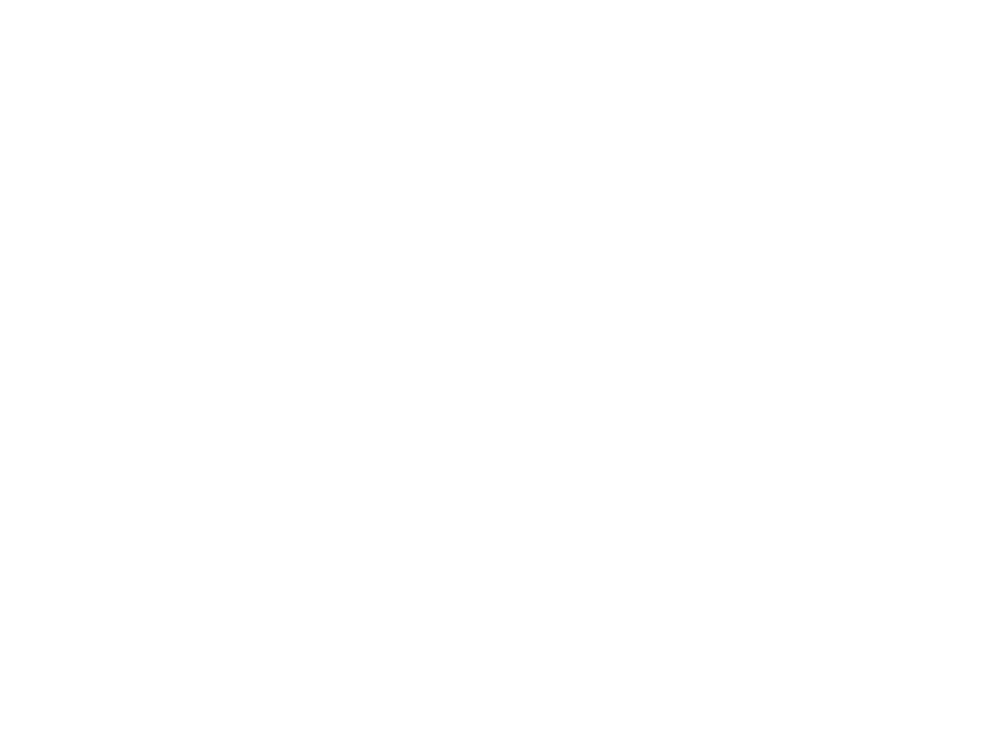

# ExplAIstic 📸

ExplAIstic is an image captioning and image hashtagging application that generates nicely written captions and adds related hashtags to your images. It utilizes pre-trained Imagenet models and ChatGPT for the image analysis and caption generation, and the Telegram API for the messaging feature.

## Installation 🚀

To use the application, you need to install the following dependencies:

- Python 3.6 or later
- PyTorch
- transformers
- NumPy
- Flask
- python-telegram-bot

You can install all of these dependencies by running `pip install -r requirements.txt` from the project directory.

Note: depending on your system configuration, you might need to manually install the PyTorch and transformers packages with a specific version, such as `torch==1.9.0` and `transformers==4.9.1`.

## Usage 🕹️

To use the application, you need to get the Telegram bot token by creating a bot on Telegram's BotFather. Then, you can run the following command from the project directory to start the Flask app:

Once the Flask app is running, you can send an image to the Telegram bot, and it will automatically generate a caption and related hashtags for the image.

## Contributing 🤝

If you find any bugs or issues, feel free to open an issue on GitHub. Pull requests are also welcome!

## Credits 🙏

ExplAIstic was created by [your name here]. It utilizes pre-trained Imagenet models from PyTorch, ChatGPT from OpenAI, and the transformers package from Hugging Face. The Telegram API was used for messaging.

## License 📝

ExplAIstic is licensed under the MIT license. See [LICENSE](LICENSE) for more information.

## Acknowledgments 👏

Thank you to the PyTorch, OpenAI, and Hugging Face communities for providing pre-trained models that were instrumental in the creation of this project. Special thanks to the Telegram team for providing an easy-to-use API for messaging.
